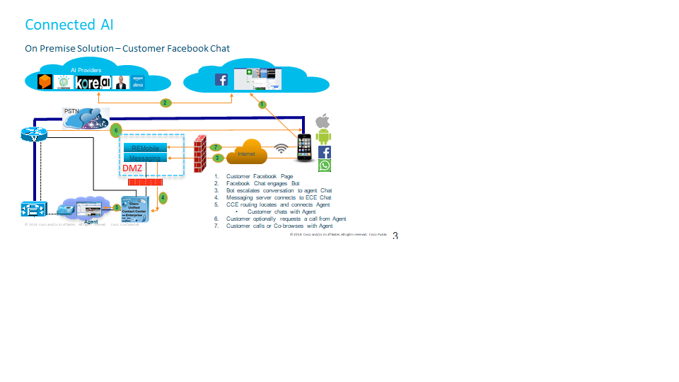
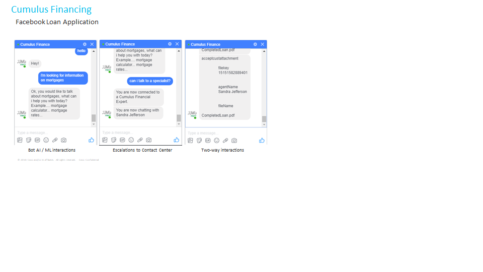

# Facebook Chat Bot Demo

This demo shows the integration with [Facebook Messenger](https://developers.facebook.com/),
[DialogFlow](https://console.api.ai), and the [Cisco ECE](https://www.cisco.com/c/en/us/support/docs/customer-collaboration/enterprise-chat-email/212332-enterprise-chat-and-email-ece-11-6-cus.html).

This example is simular to the Web Chat example which allows you to utilize Dialogflow applications and integrate with the Cisco PCCE / UCCE Contact Center.
>  Prerequisites
- >  DialogFlow 
- >  Cisco Contact Center (UCCE / PCCE) version 11.6
- >  Cisco Enterprise Chat and Email Version 11.6
  
>  Optional 
- > Remote Expert Mobile version 11.6
  
Because the chat interface is provided by Facebook, we cannot program the interface directly, therefore we must interact
with Facebook from a server side application. Within the architecture shown below, the server side application is shown 
as the 'Messaging Server'. This example software is the "Messaging Server' which is implemented as a Node.js server in the DMZ
or hosted elsewhere.

Facebook communicates with our Messaging server via 'Webhooks', therefore we will need to listen at a certain URL and Port
number which you will need to configure within Facebook Messaging. [See Facebook Webhooks](https://developers.facebook.com/docs/messenger-platform/webhook)
 
>  Configuration Required

> Note: The configuration hard codes the customers information. In a production system you would include a mechanism
> to authenticate the customer, retrieve account information and then use this information within the interaction. Also
> you will notice other code within this project that performs other tasks, feel free to disregard or remove functions
> or features that you won't use.

The first configuration task will be to set up credentials for Facebook and DialogFlow. You can set these up in the
'.env' file within the project root.

- [ ] PAGE_ACCESS_TOKEN = 
- [ ] APIAI_TOKEN = 
- [ ] FACEBOOK_APPID = 
- [ ] FACEBOOK_SECRET = 

Much of the application is written within the 'webhook.js' file, The next configuration task within this file is 
for the ECE integration. Here will will set the host URL for ECE and the Chat Entry Point for your ECE system.

- [ ] myLibrarySettings.CORSHost = "https://your ece web server/system";
- [ ] myLibrary.CORSHost = "https://your ece web server/system";
- [ ] var ChatEntryPointId = "1001";

> Note:
- >  You will need to configure the same settings for the ECE server in the 'egain/egainparameters.js' file as well 
  
Next configuration task will be the customers info gatered from your authentication mechanism;

- [ ] var PhoneNumber = "";
- [ ] var EmailAddress = "michael.littlefoot@cc.com";
- [ ] var FirstName = "Michael";
- [ ] var LastName = "Littlefoot";

# Sample Dialog

